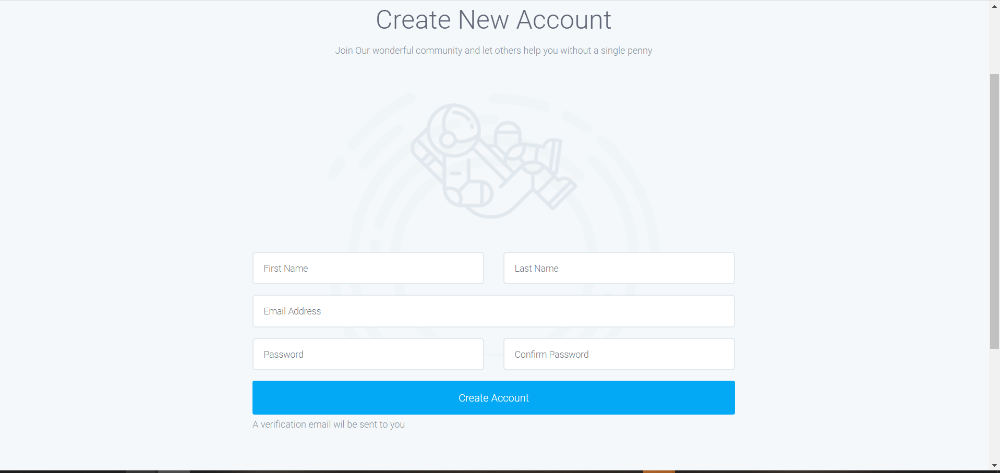
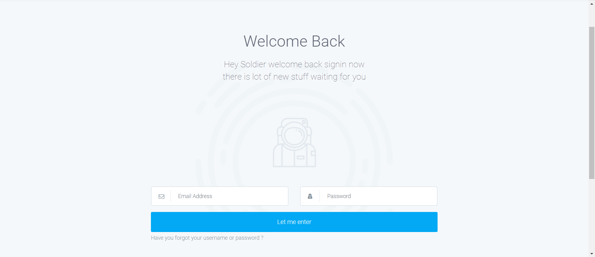
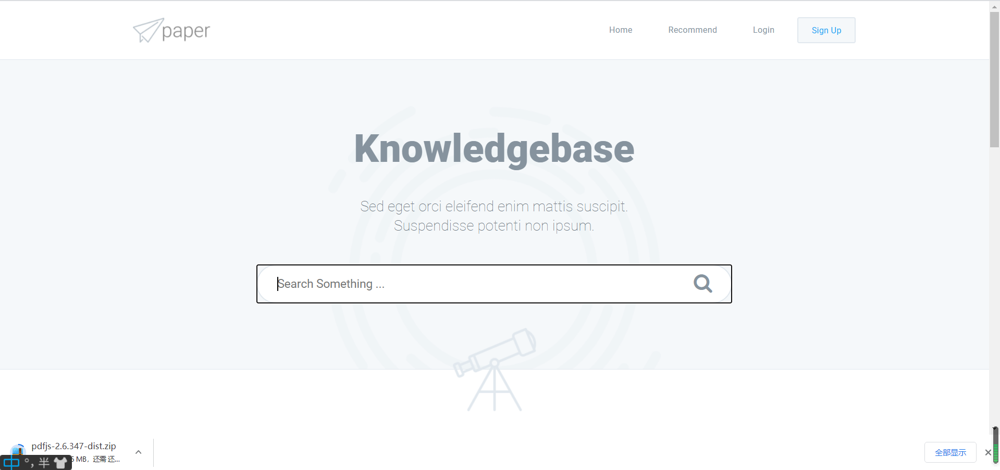
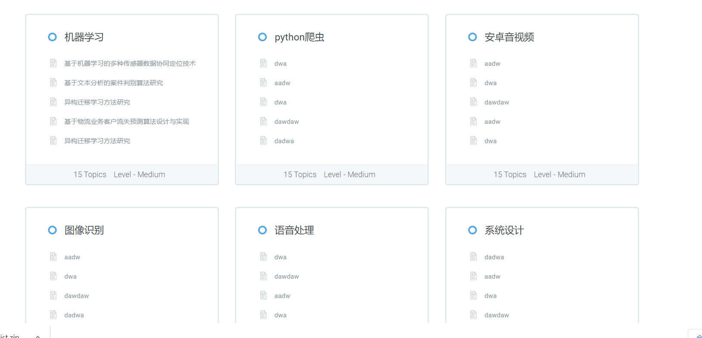
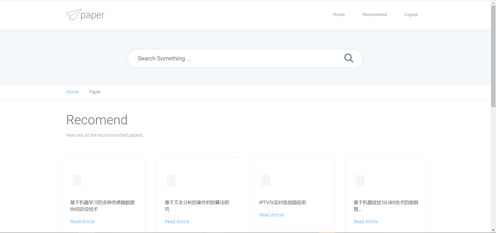
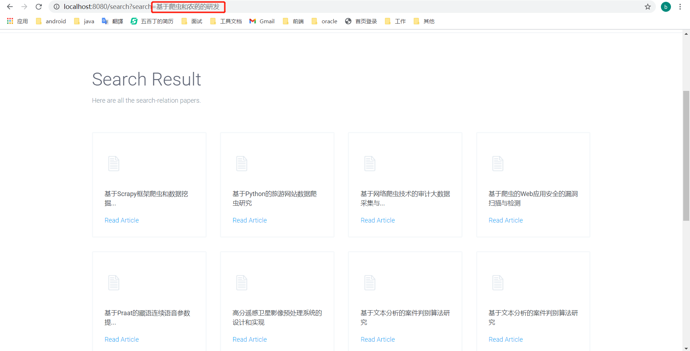
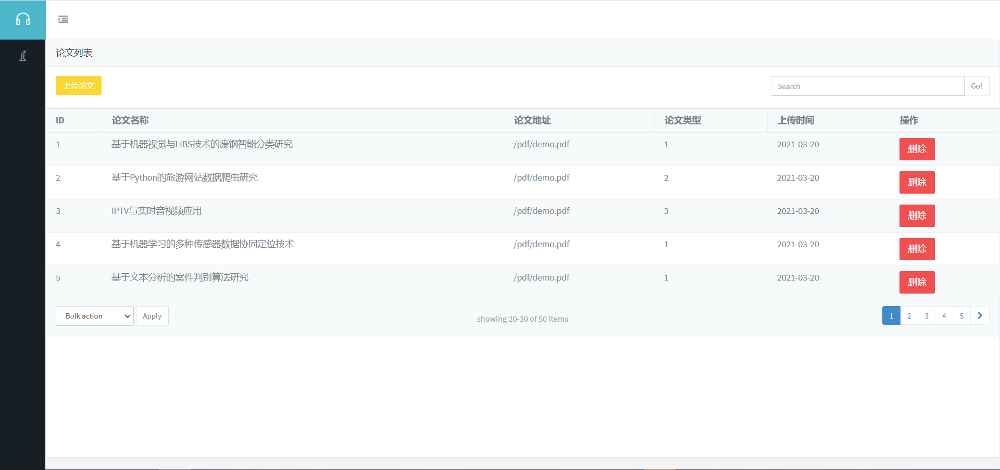

# PaperRecommend
帮朋友做的一个小Demo，基于协同过滤的论文推荐系统，

### 技术栈：

- 账号激活 springboot-mail
- 浏览记录下载记录防恶刷 Redis
- 论文检索 ElasticSearch
- 论文展示 Pdf.js
- 前后端交互 Ajax

### 主要流程

**临近用户的协同过滤推荐**

- 新用户注册之后，为了避免**用户冷启动**问题，先从当前浏览量最多的文章中随机抽取12篇论文作为当前用户的推荐列表
- 用户登录之后，所有的搜索、浏览、下载都被**隐性记录**，作为用户对该论文的评分依据
- 检索的时候采用ES分词搜索，从相关度最高到最低顺序返回
- 生成KNN矩阵，协同运算，生成推荐列表。

#### 效果图

	img/

	img/

	img/

	img/

	img/

	img/
